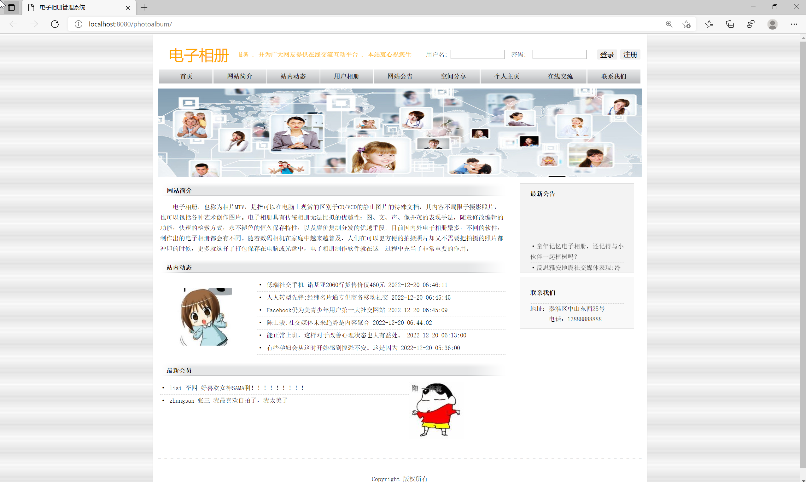
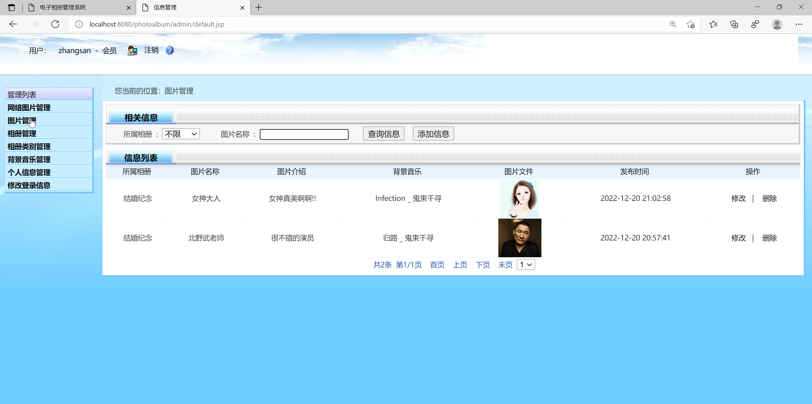
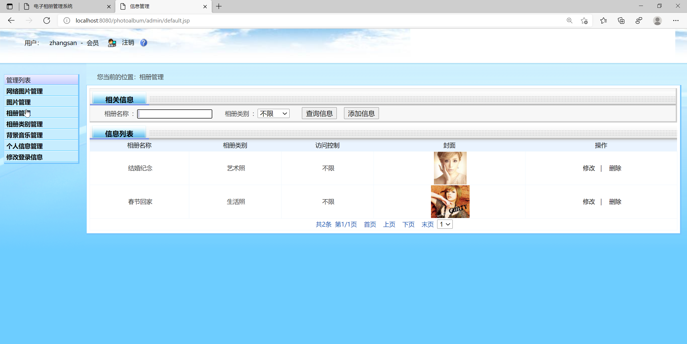

<h1 align="center">基于JSP+Servlet的相册管理系统</h1>

 获取sql文件 QQ: 3645296857 QQ群: 978300347 

<b> 需要视频演示可联系上述QQ，私发视频链接 </b>

 获取更多高质量源码，请访问：[mzoo源码网](https://mzoocodes.com/)

## 简介

> 本代码来源于网络,仅供学习参考使用!
>
> <b style="color: dodgerblue"> 提供1.远程部署/2.修改代码/3.定制程序/4.文档指导/5.框架代码讲解、技术解答、代码讲解等服务 </b>
>
> 管理员登录地址：http://localhost:8080/photoalbum/admin/
>
> 管理员: admin 密码: admin
>
> 用户登录地址：http://localhost:8080/photoalbum/
> 
> 用户：zhangsan 密码: 123

## 项目介绍

基于JSP+Servlet的相册管理系统：前端 JSP、BootStrap、JQuery、Ajax，后端 Servlet，系统角色分为：用户和管理员。本系统采用B/S结构，使用JAVA开发语言，结合JSP技术，以MySQL作为后台数据库。该系统包括前端用户界面和后台管理。主要功能如下：

### 管理员
- 基本操作：登录、修改密码、重置其他账号密码、注册、登出
- 管理员管理：筛选管理员、添加管理员信息、修改管理员信息、删除管理员、获取管理员列表、查看管理员详情
- 会员管理：筛选会员、修改会员信息、删除会员、获取会员列表、查看会员详情
- 公告管理：获取公告信息列表、筛选公告信息、添加公告信息、修改公告信息、删除公告信息、查看公告信息详情
- 动态管理：获取动态信息列表、筛选动态信息、添加动态信息、修改动态信息、删除动态信息、查看动态信息详情
- 图片管理：获取图片信息列表、筛选图片信息、删除图片信息、查看图片信息详情
- 相册管理：获取相册信息列表、筛选相册信息、删除相册信息、查看相册信息详情
- 相册类别管理：获取相册类别信息列表、筛选相册类别信息、删除相册类别信息、查看相册类别信息详情
- 背景音乐管理：获取背景音乐信息列表、筛选背景音乐信息、删除背景音乐信息、查看背景音乐信息详情
- 网站简介：查看网站简介详情、修改网站简介信息
- 联系我们：查看联系我们详情、修改联系我们信息

### 用户
- 基本操作：登录、获取个人信息、修改个人信息、注册
- 网站简介模块：获取简介内容
- 联系我们模块：获取联系我们内容
- 站内动态模块：获取站内动态列表、查看动态详情
- 用户相册模块：获取用户相册列表、查看用户相册详情、评论
- 网站公告模块：获取公告内容列表、查看公告详情
- 空间分享模块：获取空间分享列表、查看空间分享详情、添加好友、评论
- 在线交流模块：获取帖子列表、查看帖子详情、发表帖子
- 图片管理：获取图片信息列表、筛选图片信息、添加图片信息、编辑图片信息、删除图片信息、查看图片信息详情
- 相册管理：获取相册信息列表、筛选相册信息、添加相册信息、编辑相册信息、删除相册信息、查看相册信息详情
- 相册类别管理：获取相册类别信息列表、添加相册类别信息、编辑相册类别信息、筛选相册类别信息、删除相册类别信息、查看相册类别信息详情
- 背景音乐管理：获取背景音乐信息列表、添加背景音乐信息、编辑背景音乐信息、筛选背景音乐信息、删除背景音乐信息、查看背景音乐信息详情

## 环境

- <b>IntelliJ IDEA 2020.3</b>

- <b>Mysql 5.7.26</b>

- <b>Tomcat 9.0.41</b>

- <b>JDK 1.8</b>

## 运行截图

